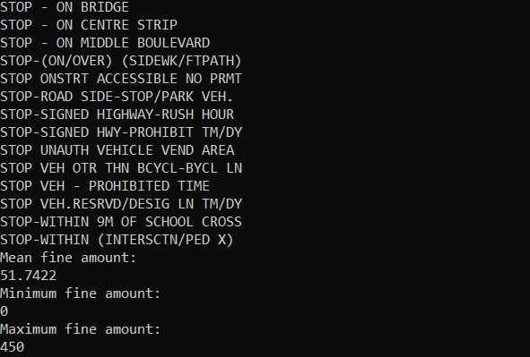
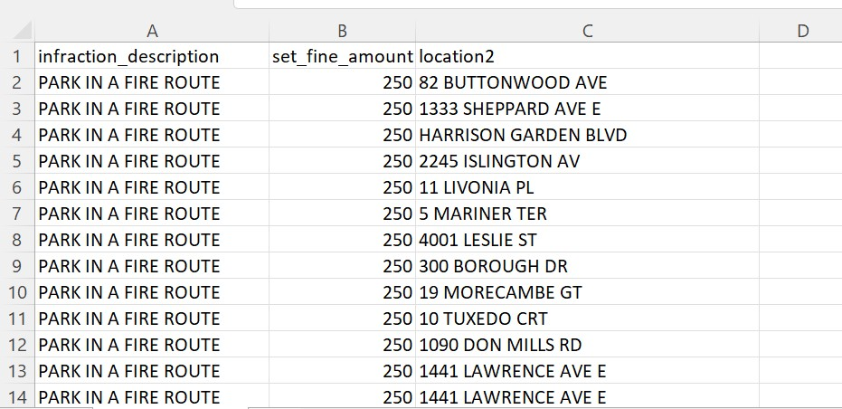

# Git and GitHub Assignment - Parking Infractions Analysis

## Description
This repository was created as part of an assignment for the Data Science Foundations course at the University of Toronto's Data Sciences Institute. The assignment involves creating a repository on GitHub and pushing a shell script, a CSV file and a README file to the repository. 

The shell script is written in bash and takes the CSV file as a positional parameter from the terminal as the input. The CSV file is a dataset containing information related to parking tickets issued in Toronto, and is downloadable from the [City of Toronto](https://open.toronto.ca/dataset/parking-tickets/) website.

## Usages
The script takes the `parking_data.csv` file as a positional parameter from the terminal as the input:


It then outputs in alphabetical order the different types of parking infractions to the terminal, as well as calculate the mean, minimum and maximum values of all parking fines:


For each instance of the infraction "parking in a fire route" listed in the CSV file, the script outputs the infraction description, the fine amount and the street address, along with their original headings to a separate CSV file called `firerouteinfraction.csv`:



## How to Use 

### Files relevant for running the script
- assignment1.sh (main directory/folder)
- parking_data.csv (data subdirectory/folder)

### Download assignment files

If you wish to 
1. Scroll to the top of the repository main page, and click on the green "Code" button. 
2. Select "Download ZIP," and save the file on your computer.
3. Right click on the zipped file, select extract all, and select a directory on your Desktop you would like to extract all of the project files to.
4. Open a Linux terminal. (e.g., [Ubuntu](https://ubuntu.com/))
5. Change the working directory to the directory that contains the assignment1.sh file using `cd`. For example, if the file exists in a directory called `dsf-assignment` on your Desktop, enter `cd ~/Desktop/dsf-assignment` on the command line.
6. Enter `./assignment1.sh data/parking_data.csv` on the command line to execute the script, taking the `parking_data.csv` file in the `data` subdirectory as its input.

## Support
For help with installation or running the script, please email sally.choi@utoronto.ca.

## Contributors
```Sally Choi - https://github.com/smychoi
```Yongran Yan - https://github.com/KaryYan

Big thanks to our instructor Rachael Lam and teaching assistant Salaar Liaqat for their guidance and support on the assignment and throughout the course.